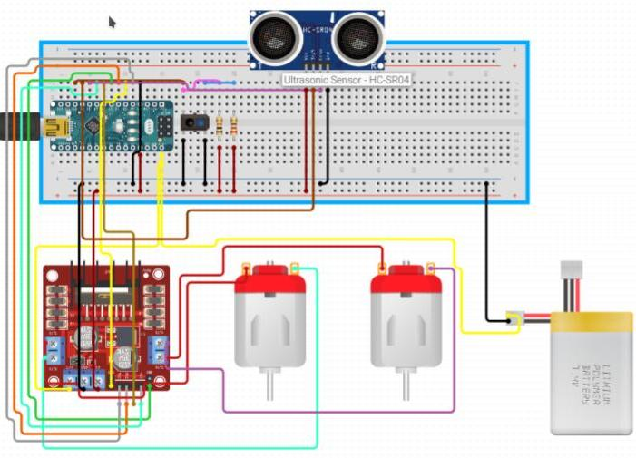
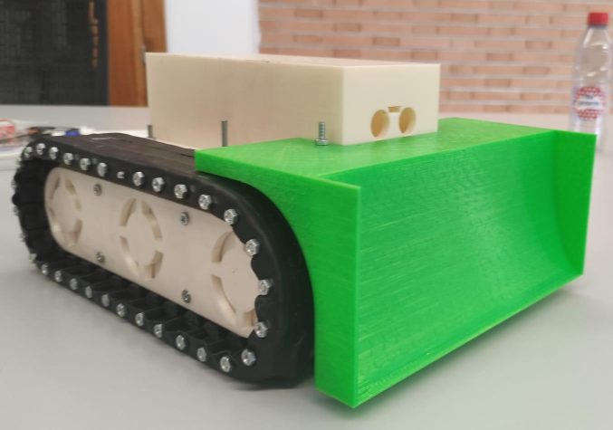
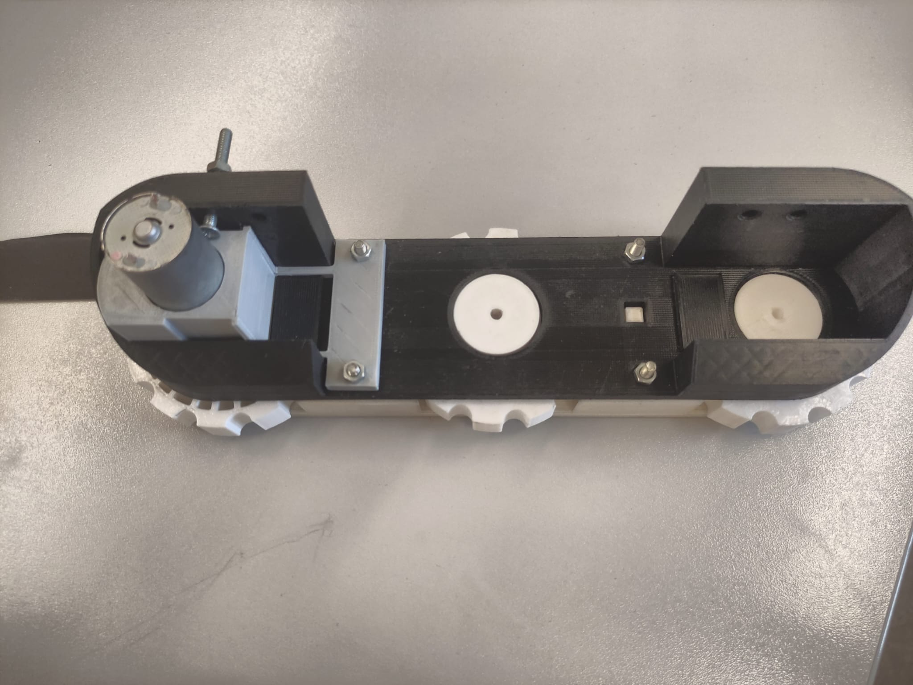
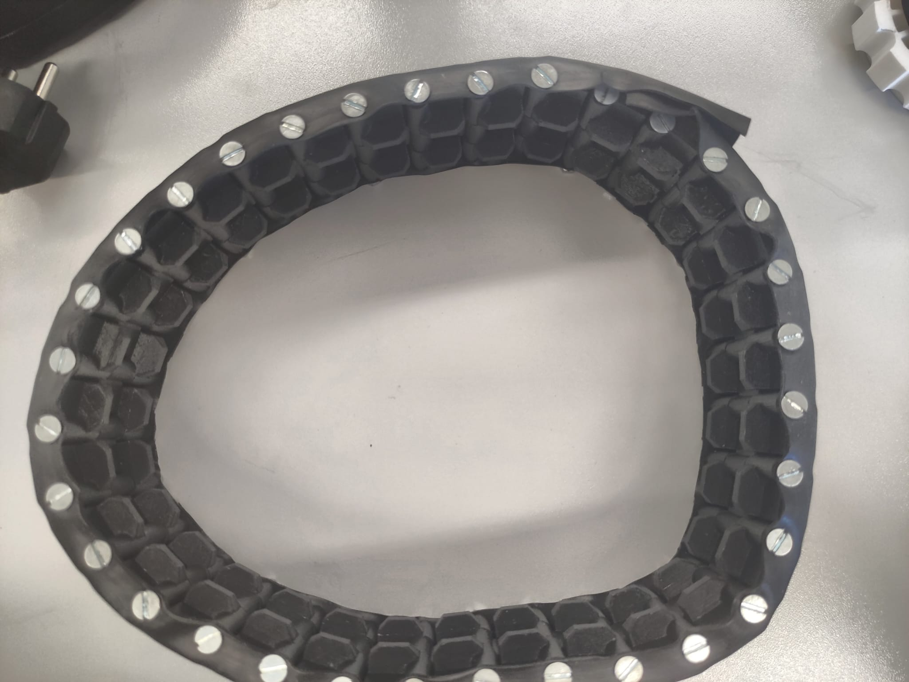
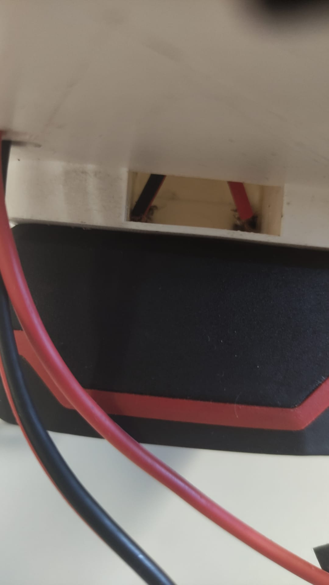
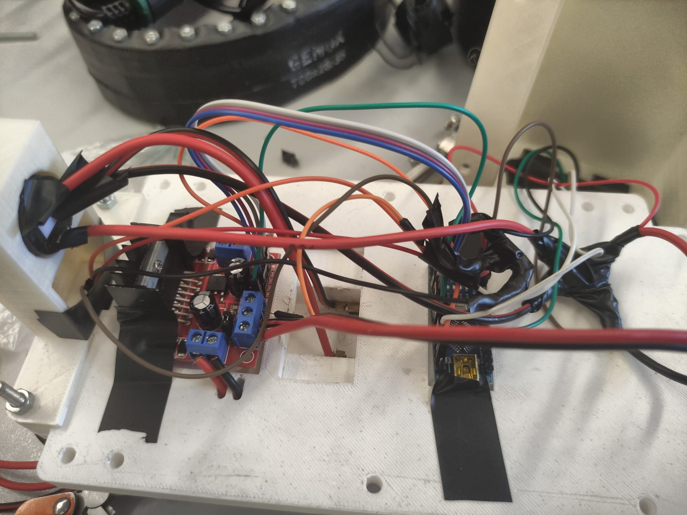
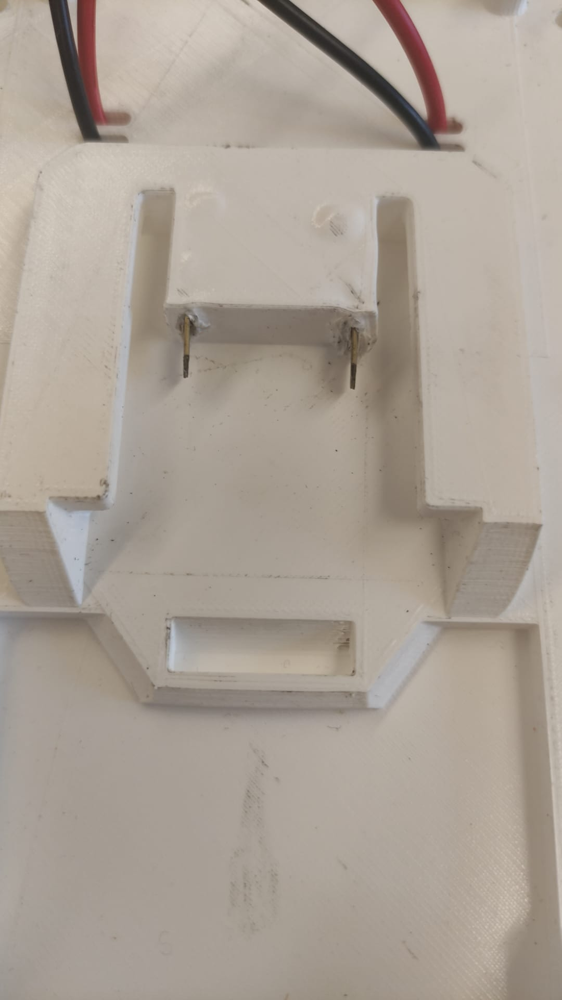

# Tank-Type Robot Project

Welcome to the Tank-Type Robot project! This project involves building a tank-style robot using an Arduino Nano and various electronic components. Additionally, all designed parts are created by me for 3D printing in PLA.

## Components

### Electronics
- **HW-095 H-Bridge**
- **HC-SR04 Ultrasonic Sensor**
- **CNY70 Reflective Optical Sensor**
- **Voltage Regulator configured to 12V**
- **Arduino Nano**
- **12V Motors with Gearbox 25GA-370 30RPM**

### Designed Parts
- **Tracks**
- **Base**
- **Ramp Shield**

## Features

- **Tank-style locomotion**: The robot uses tracks for movement, allowing it to navigate rough terrain.
- **Ultrasonic obstacle detection**: The HC-SR04 sensor enables the robot to detect and avoid obstacles.
- **Reflective surface detection**: The CNY70 sensor helps the robot identify and respond to different surface types.
- **Custom 3D-printed parts**: All structural components, including tracks, base, and ramp shield, are designed by me and printed in PLA.

## Schematics

## Images

